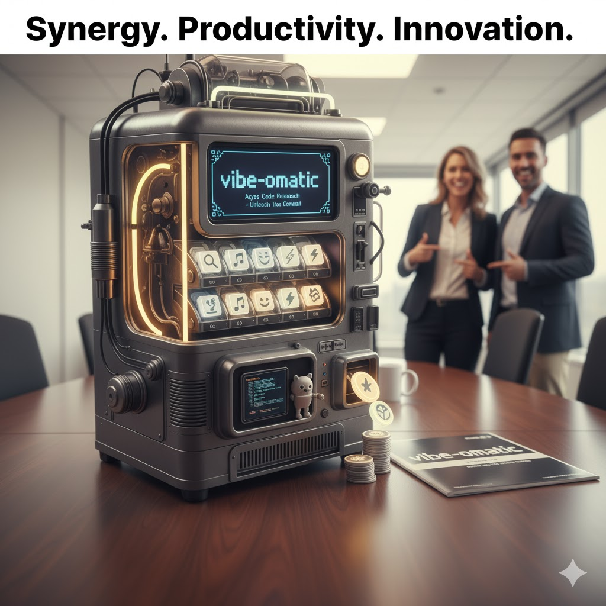

# Vibe-o-matic

> **_Catalyzing transformative synergies for next-gen cognitive agility in the asynchronous paradigm_**

In an ever-evolving ecosystem of dynamic market forces and disruptive innovation, the vibe-o-matic repository emerges as a pivotal force multiplier, strategically architected to empower forward-thinking organizations to proactively de-risk their strategic initiatives and optimize their core competencies.

By leveraging cutting-edge asynchronous coding agent methodologies, we seamlessly integrate granular insights from emergent data streams, thereby fostering a robust framework for scalable solutioning and actionable intelligence.

This disruptive platform is meticulously calibrated to unlock unprecedented levels of cross-functional collaboration, driving mission-critical deliverables and future-proofing your enterprise against the vagaries of a rapidly decentralizing digital landscape. Dive deep into a paradigm where agility meets profound data-driven foresight, fundamentally redefining your operational cadence and stakeholder engagement.

## Portfolio of synergistic experiments

Below is the current roster of initiatives operating under the vibe-o-matic umbrella.

- **AI Game Master (`ai-gm/`)**: A client-only, rules-faithful B/X D&amp;D-compatible tabletop RPG companion with BYOK OpenAI integration, local PDF parsing, and journal-based save files.
- **Oracle CLI (`oracle-cli/`)**: A stateless Python CLI that delivers solo RPG oracles, including yes/no answers, muse prompts, plot twists, chaos pool rolls, and polyhedral dice.
- **Textual TUI (`textual-tui/`)**: A Textual-powered terminal shell for future vibe-o-matic experiences, currently shipping with a header/footer scaffold, a quit binding, and a light test suite.

*Special thanks to Simon Willison in [Code research projects with async coding agents like Claude Code and Codex](https://simonwillison.net/2025/Nov/6/async-code-research/) for repo inspiration. Don't blame Simon for the ridiculousness that's in here, though - that's all me. And my robot overlords.*
